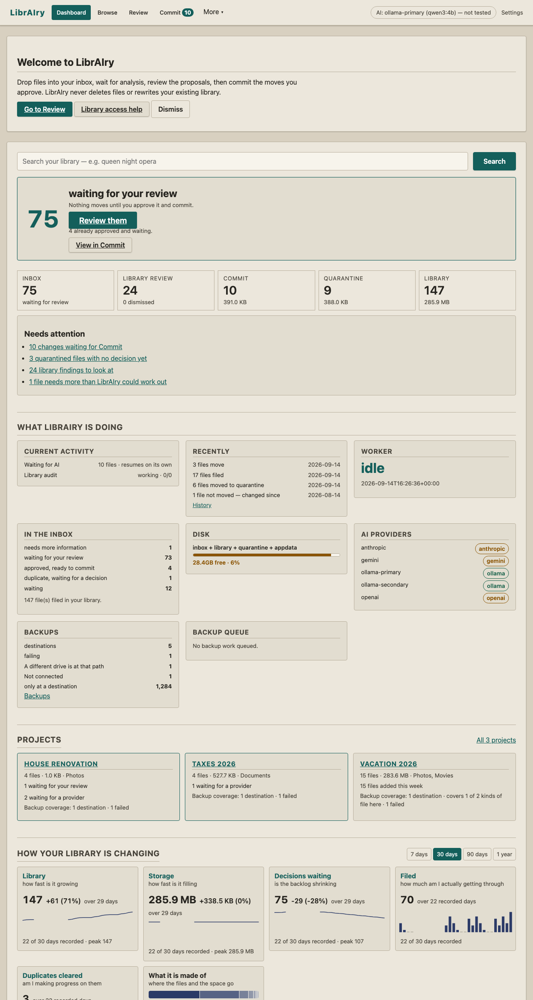

# LibrAIry

Privacy-first, AI-assisted file organization for a NAS or workstation.

LibrAIry watches an inbox, analyzes stable files, stages reviewable proposals, and moves files only after you approve and commit a plan in the web portal. It never deletes user files, never overwrites existing destinations, and treats the existing library as read-only input.



## Why I built this

LibrAIry started as a tool for fixing the file structure on a company NAS.

Nothing about that share was broken. It mounted, it was backed up, it held years of everybody's work. It was just that nobody could find anything on it, and nobody wanted to be the person who tidied it — because tidying a share other people depend on means moving other people's files, and if you get it wrong you have ruined somebody's afternoon and you get to explain why.

Every tool I looked at proposed to solve that by doing it for me. That was the one thing I could not allow. So the first version had a single rule, and everything since has been built around it:

**It may look at everything, and change nothing until I say so.**

It read the share, worked out what each file probably was and where it probably belonged, and handed me a list. I made the decisions. It carried them out afterwards, as one batch, and wrote down exactly what it had done so any of it could be put back.

That is still the shape of the program. It is why Review and Commit are two separate screens, why an approved plan is executed exactly as approved instead of being recomputed at the last moment, why every move is journaled and hash-verified, and why there is no delete button anywhere in the product.

Once the NAS was in order I kept using it, and it moved to my homelab. It runs there in Docker against my own library — music, photos, films, documents, whatever comes off a camera card — and it grew the things a personal library needs that a work share did not: duplicate detection, quarantine instead of deletion, undo that understands the order decisions were made in, search inside file contents, files that belong together staying together, and a health screen that says what actually needs attention.

It is a homelab app now. It is still the same program that is not allowed to touch anything without being told to.

## 5-Minute Docker Quickstart

```bash
cp .env.example .env
mkdir -p data/inbox data/library data/quarantine data/appdata
docker compose up -d --build
```

Open `http://localhost:8080` and drop files into `data/inbox`. No password is required on a trusted LAN; set one any time in Settings -> Portal Security, or force it at boot with `AUTH_REQUIRED=true`.

## What You Get

- **Local-first AI.** Ollama or LM Studio on your own network. Cloud providers stay off until you add a key and enable one deliberately, and prompts are structurally redacted before anything leaves the house.
- **Review, then Commit.** Proposals you approve one at a time or in bulk, a plan you can read before it runs, and one execution that does what the plan says.
- **Nothing gets deleted.** Duplicates go to a reversible quarantine. Files you are finished with go to a delete queue that you empty yourself, in your own file manager.
- **Undo that is honest about order.** A newer decision that depends on an older one blocks reversing it, instead of half-succeeding and leaving you to work out what happened.
- **Files that belong together stay together.** RAW/JPEG pairs, Live Photos, a film and its subtitles, a camera card imported as one collection.
- **Format Policy.** What you prefer, what you permit, and what you protect — answered once, applied to proposals, and never acted on by itself.
- **Health, Reconcile and History.** What needs a decision now, what the database and the disk disagree about, and exactly what has already happened.
- **SQLite + FTS5 index** in appdata, rebuildable at any time with `librairy index rebuild`.
- **A clean LAN portal** that is light enough to run on a NAS and usable on a phone. Retro looks — green-on-black, amber CRT — survive as optional colour themes, not as the shape of the thing.

## Documentation

**Start here**

- [What LibrAIry is — principles, authority, safety invariants](docs/PRODUCT.md)
- [Roadmap — the current plan of work](docs/ROADMAP.md)

**Installing and running**

- [Docker install](docs/install-docker.md)
- [UNRAID install](docs/install-unraid.md)
- [Configuration](docs/configuration.md)
- [LM Studio on your LAN](docs/lm-studio.md)
- [Running LibrAIry — install, upgrade, backup, restore, reconcile, roll back](docs/operations.md)
- [Deploying a release to a NAS](docs/deploying-a-release.md)
- [Using LibrAIry](docs/using-librairy.md)
- [The command line](docs/cli.md)
- [Troubleshooting](docs/troubleshooting.md)
- [Security](docs/security.md)
- [Backup and restore](docs/backup-restore.md)
- [One-way backup](docs/backup.md)
- [Content search](docs/content-search.md)

**How it thinks** — the permanent principles, in [docs/architecture/](docs/architecture/)

- [Files that belong together](docs/architecture/relationships.md)
- [Format Policy](docs/architecture/format-policy.md)
- [Undo and the order of decisions](docs/architecture/undo-sequencing.md)
- [The delete queue](docs/delete-queue.md)
- [Two decisions that cannot both be right](docs/architecture/plan-conflicts.md)
- [Health — what needs attention now](docs/architecture/health.md)
- [Restoring, and agreeing about what you have](docs/architecture/restore-reconciliation.md)
- [Decisions you took back](docs/architecture/withdrawn-decisions.md)
- [Release acceptance](docs/release-acceptance.md)
- [Performance](docs/performance.md)
- [FAQ](docs/faq.md)
- [Superseded planning history](docs/history/README.md)

## Development

```bash
python -m venv .venv
.venv/bin/pip install -e ".[dev]"
.venv/bin/ruff check src tests scripts
.venv/bin/pytest
docker compose config
```

### Looking at a page

DOM assertions pass happily while a page is visibly wrong, so there is a
harness that opens one in a real browser and measures it:

```bash
.venv/bin/python scripts/ui_check.py review
```

It builds a throwaway library containing one of every finding shape,
screenshots the page at 1280px and at a true 375px, and reports anything
sticking out past the edge. Screenshots land in `.dev/`, which is gitignored.

The screenshot at the top of this file was taken the same way, against the same
throwaway fixture library — so it is a real page rendered by a real browser, and
none of it is anybody's actual files.

**Headless Chrome is a development validation tool only. It is not part of
LibrAIry production runtime.** There is no browser in the image, no browser
service in Compose, nothing in `src/librairy` that imports the harness, and
nothing that starts a browser on a timer or in the background. The harness
uses whatever Chrome the developer already has, in a temporary profile it
deletes on the way out, and it says so plainly and exits if there is none.
`tests/test_dev_tooling.py` asserts each of those rather than trusting this
paragraph.

## Safety Guarantees

- No deletion path exists for user files.
- Destination collisions resolve to deterministic alternate names.
- Commit executes an approved immutable plan, not a recomputed analysis.
- Undo is journaled and hash-verified.
- Cloud AI prompts are structurally redacted and cloud providers are opt-in.
